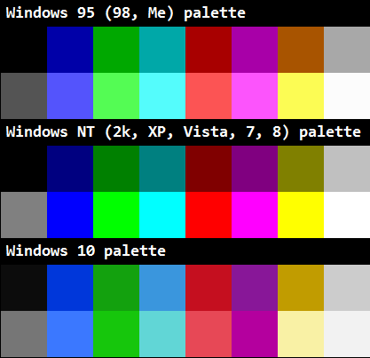

# base16-windows-scheme

The Windows colour schemes throughout the years. Windows NT provides the highest contrast of the generations, with Windows 95 suffering from low contrast blacks and Windows 10 suffering from low contrast literally everywhere else. The Windows 10 palette is not recommended and is only included for completeness.

The Windows High Contrast theme combines the NT dark palette with the 95 bright palette. This gives the highest contrast combination with all dark and bright colours except for bright white, which is slighter dimmer than the NT bright white.

