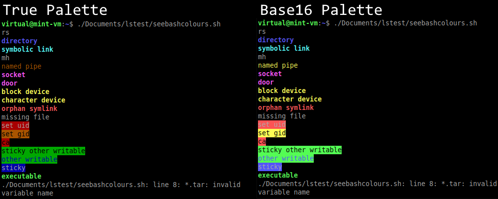
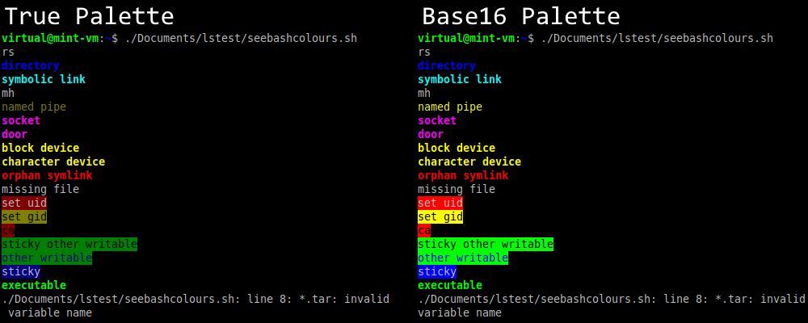
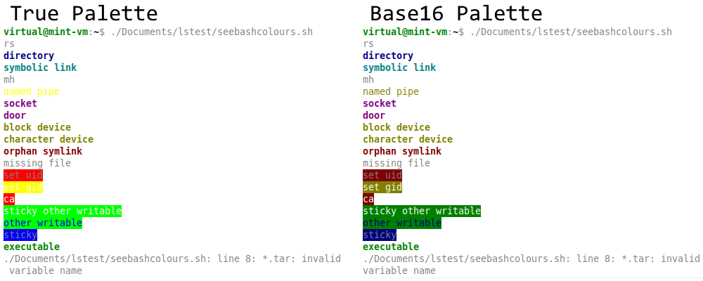
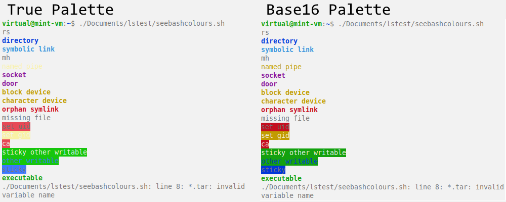
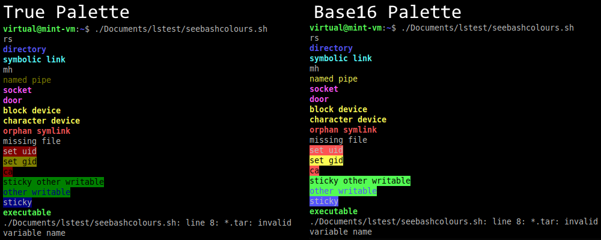

# Base16 Windows Scheme
## Overview
The Windows colour schemes throughout the years, made for Chris Kempson's [base16](https://github.com/chriskempson/base16) theme building architecture. Windows NT provides the highest contrast of the generations, with Windows 95 suffering from low contrast blacks and Windows 10 suffering from low contrast literally everywhere else. The Windows 10 palette is not recommended and is only included for completeness.

The Windows High Contrast theme combines the NT dark palette with the 95 bright palette. This gives the highest contrast combination between all dark and bright colours except for bright white, which is slighter dimmer than the NT bright white.

For the true Windows-emulating experience be sure to use the Consolas font with letter spacing set to -1 and unbolden your prompt!

## Low Contrast Colour Removal
The Base16 framework replaces dark colours with their bright counterparts in dark schemes and vice versa in light schemes to ensure high contrast against the background. An example of the result of this effect for each theme can be seen in their respective sections below.

### Default 95 Colours
This palette was used in Windows 95, 98, and ME.

### Light 95 Colours
The 95 palette with the dark and light colours inverted.

### Default NT Colours
This palette was used in Windows 2000, XP, Vista, 7, 8, and 10 (up to build 16256).

### Light NT Colours
The NT palette with the dark and light colours inverted.

### Default 10 Colours
This palette has been in use from Windows 10 build 16257 onward.

### Light 10 Colours
The 10 palette with the dark and light colours inverted.

### Default High Contrast Colours
This theme has never been used by Microsoft for a version of Windows, it is just a combination of the NT dark palette and the 95 bright palette.

### Light High Contrast Colours
The High Contrast palette with the dark and light colours inverted.

